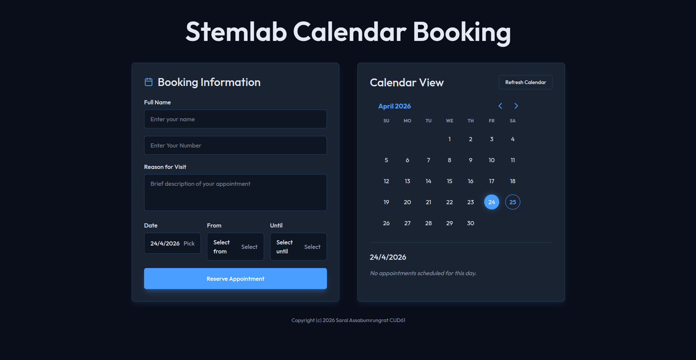

# Stemlab Calendar Booking

A Dockerized React + Node booking app that:

- reads events from a Google Calendar
- shows them in the website calendar view
- creates new Google Calendar events from website reservations

Webpage Preview



## Requirements

- `git`
- `docker` and `docker compose`

Optional for local non-Docker work:

- `node >= 20`
- `npm`

## Clone

```bash
git clone https://github.com/saralray/Stemlab-Calendar.git
cd Stemlab-Calendar
```

## Setup

### 1. Create `.env`

Copy the example file:

```bash
cp .env.example .env
```

Update `.env` with your values:

```env
GOOGLE_API_KEY=your-google-api-key
GOOGLE_CALENDAR_ID=YOUR_GOOGLE_CALENDAR_ID
GOOGLE_CALENDAR_TIMEZONE=Asia/Bangkok
GOOGLE_SERVICE_ACCOUNT_JSON_HOST_DIR=./secrets
GOOGLE_SERVICE_ACCOUNT_JSON_FILE=/app/secrets/service-account.json
```

Notes:

- `GOOGLE_API_KEY` is used for calendar reads
- the service account JSON is used for event creation
- the app now prefers the full JSON file over pasting private keys into `.env`

### 2. Add the service account JSON

Put the downloaded Google service account JSON here:

[secrets/service-account.json](/home/saral/Stemlab-Calendar/secrets/service-account.json)

The file should come directly from Google Cloud when you create a key for the service account.

### 3. Share the Google Calendar with the service account

In Google Calendar, add this service account email to the target calendar with at least:

- `Make changes to events`

If you do not do this, reservation creation will fail with:

- `You need to have writer access to this calendar.`

## Run with Docker

```bash
docker compose up -d --build
```

Open:

`http://localhost:8080`

## Rebuild / Reload

```bash
docker compose up -d --build
```

## Stop

```bash
docker compose down
```

## Run on Kubernetes

Manifests live in [`k8s/`](k8s/): namespace, config, secret, deployment, service,
ingress, and a HorizontalPodAutoscaler, tied together by `kustomization.yaml`.

### 1. Create the secret

`k8s/secret.yaml` is gitignored. Create it from the example and fill in your
base64-encoded values:

```bash
cp k8s/secret.example.yaml k8s/secret.yaml
# echo -n 'value' | base64        -> for string values
# base64 -w0 secrets/service-account.json   -> for the JSON file
```

### 2. Deploy

```bash
kubectl apply -k k8s/
```

This deploys everything into the `booking-calendar` namespace. Check status:

```bash
kubectl -n booking-calendar get pods,svc,hpa,ingress
```

### 3. Access the app

- **NodePort** (works out of the box): `http://<node-ip>:30081`
- **Ingress**: edit the host in [`k8s/ingress.yaml`](k8s/ingress.yaml) to your
  real domain, then browse to it.

### Prerequisites

- The container image is published to `ghcr.io/saralray/booking-calendar-website`
  by the GitHub Actions workflow on every push to `main`.
- The HorizontalPodAutoscaler needs [metrics-server](https://github.com/kubernetes-sigs/metrics-server)
  installed in the cluster.
- The Ingress needs an ingress controller (e.g. ingress-nginx). If you don't use
  one, remove `ingress.yaml` from `k8s/kustomization.yaml` and rely on the NodePort.

## What the app does

- The booking form date stays synced with the calendar view date
- The booking date display uses `d/m/y`
- The time picker uses a popup selector
- Time choices are limited to `7:30 AM` through `5:00 PM`
- New reservations are sent through the backend and inserted into Google Calendar

## Local Development

If you want to work without Docker:

```bash
npm install
npm run build
npm run start
```

This starts the Node server on port `8080`.

## Troubleshooting

### Push to GitHub blocked by secret scanning

Do not commit:

- `secrets/service-account.json`

It is intentionally ignored by `.gitignore`.

### `No such file or directory: /app/secrets/service-account.json`

The JSON file is missing from:

[secrets/service-account.json](/home/saral/Stemlab-Calendar/secrets/service-account.json)

### `MalformedFraming`

This means the private key format is wrong. Use the full service account JSON file instead of copying the private key manually.

### `requiredAccessLevel`

The service account is authenticated, but it does not have writer permission on the target Google Calendar.

